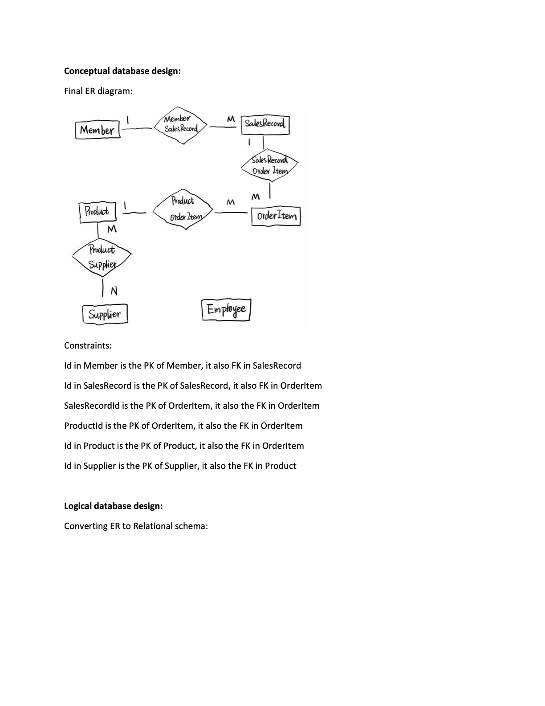
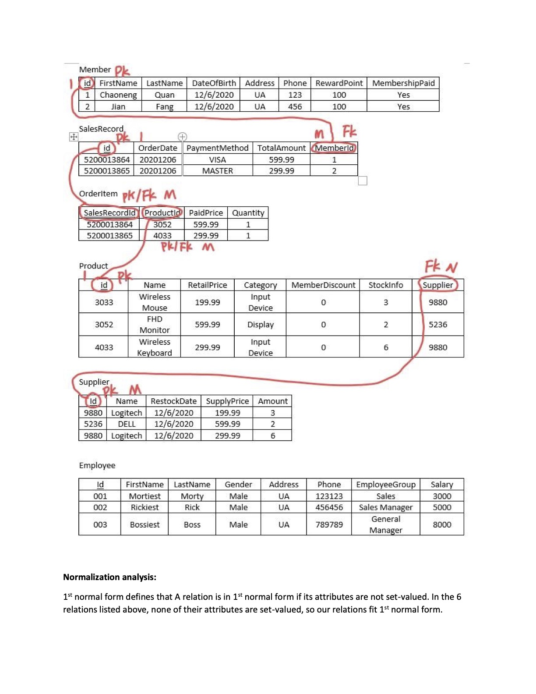
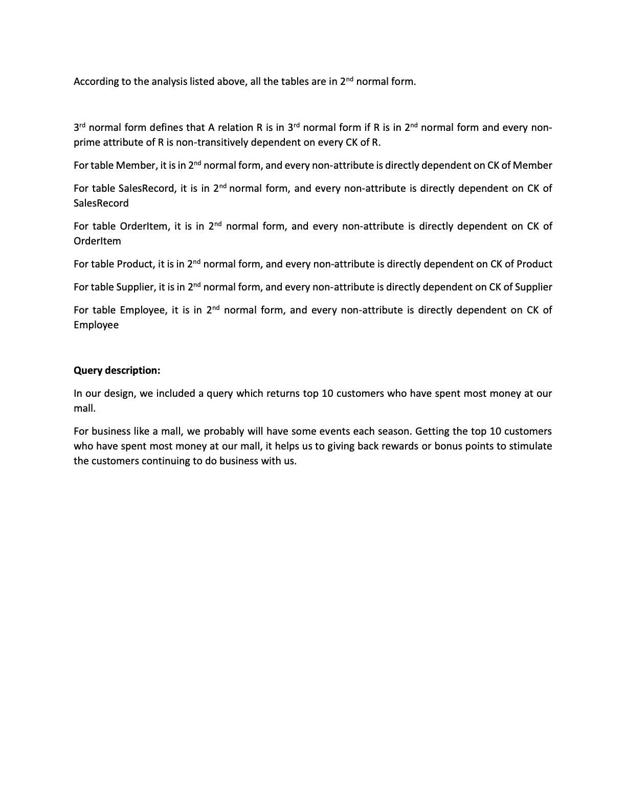

# SqlPlus-ShoppingMall
A Spring web application for a shopping mall in oracle sqlplus database

# How to run the application
First download the source code

```git clone https://github.com/ChaonengQuan/SqlPlus-ShoppingMall.git```

Then

```./mvnw spring-boot:run```

Once you see the Spring text based icon in the console, the application has successfully started

Finally, open the page in your browser. The port number has been preset to 21997, you can change that in the application.properties file

```localhost:21997```

<br /><br />
You need to manually install Oracle jdbc dependence if you don't have it installed, make sure you have the ojdbc.jar file in the same directory

then run

```./mvnw install:install-file -Dfile=ojdbc14.jar -DgroupId=com.oracle -DartifactId=ojdbc14 -Dversion=11.2.0 -Dpackaging=jar```

# Operation Instruction

Click on the button that represents the Table, then you will be redirected to a page that display all the records
currently in the table. You can click on the Delete or Update button on each record, or insert a new record at the bottom
of the page

To execute required queries, just click on the button corresponds to the query.

# Workload Distribution
Both team members' workload are about 50%

# E-R diagram and Normalization analysis



